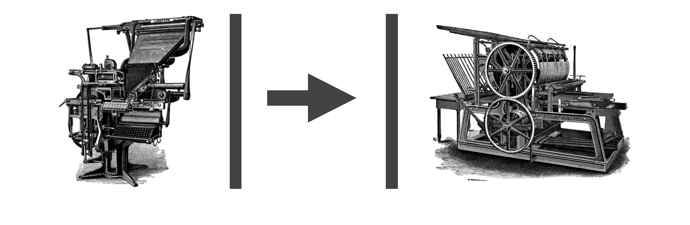

# contract-checker

A Clojure library for checking whether consumer data contracts defined in json-schema are compatible with producer contracts.

## Usage

This library is for checking that a consumer's contract (of the data they need from a producer), which may change over time is still compatible with a producer's contract (specifying the data they supply through some api/ data model).

In an SDLC process (Software Development Life Cycle), producers and consumers will evolve at different rates and times, especially where there is more than one consumer. If we can drive both producers and consumers to specify the need they produce/ need, then checking that a consumer contract is still compatitable with a producer contract adds an extra degree of comfort and automation to an SLDC process.
[Influential article](https://martinfowler.com/articles/consumerDrivenContracts.html).

Add to your project.clj (or similar):

    [contract-checker "0.1.0"]
    
The main public api is the function `check-contract` in the `contract-checker.core` namespace.

Use as follows:

    (check-contract consumer-contract producer-contract)

This function applies a vector of rules which may be optionally specified to each node in the json-schema hierarchy and returns a sequence of errors output by the rules that fail.
The two contracts should already be converted from json into clojure maps by the `clojure.data.json` library. e.g.

    (def prod-contract (json/read-str (slurp "producer-schema.json") :key-fn keyword))
    (def cons-contract (json/read-str (slurp "consumer-schema.json") :key-fn keyword))
    
The `:key-fn keyword` argument is important; this library expects keys to be keywords.

### Json interface

Alternatively, if you want to work direct from the json without needing to use the `clojure.data.json` library yourself, in the `aws` namespace, there is a function `conform-contract` which works with json given to it directly.

The input should be a single json map with the consumer schema under the "consumer" key and the producer schema under the "producer" key. The `test-schema.json` file in the resouces folder is an example of this format.

### Rules

A vector of rules can be passed to the `check-contract` function in the core namespace. This should not be neccessary as the `contract-checker.rules` namespace contains a full set of rules which return errors that are considered to of severity major or minor, depending on whether the incompatibility represents a breaking change or not.

### Callable REST service

TBD

### Visualization of json-schema

If you have Graphviz installed locally, the `contract-checker.core` namespace contains two functions for visualizing a json-schema. These are `viz` to pop open a window and display, or `viz-svg` which will return an svg string.

--

Enjoy!

## License

Copyright © 2019

MIT License
